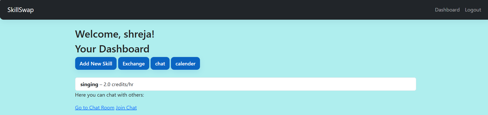
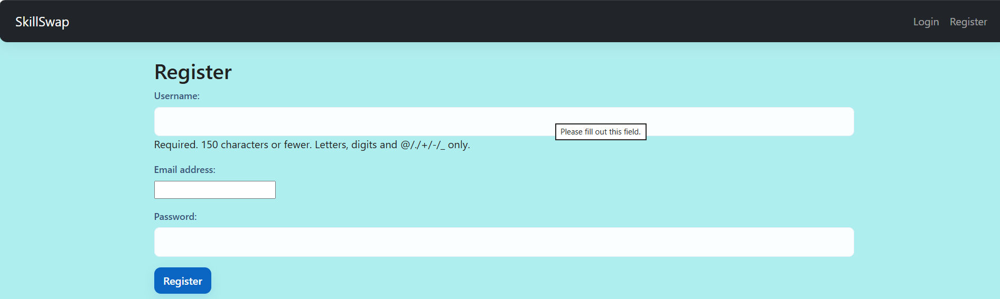
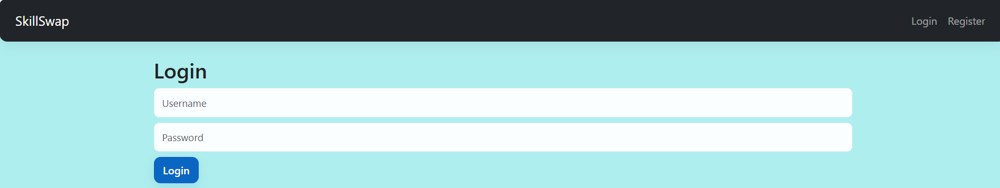
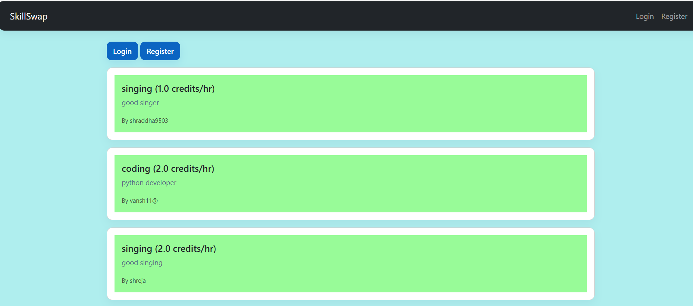
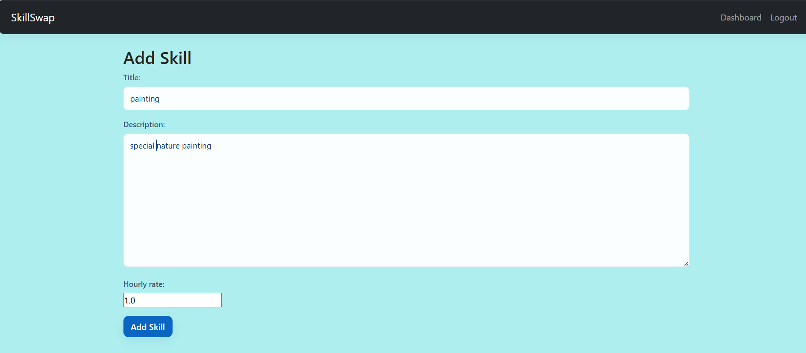
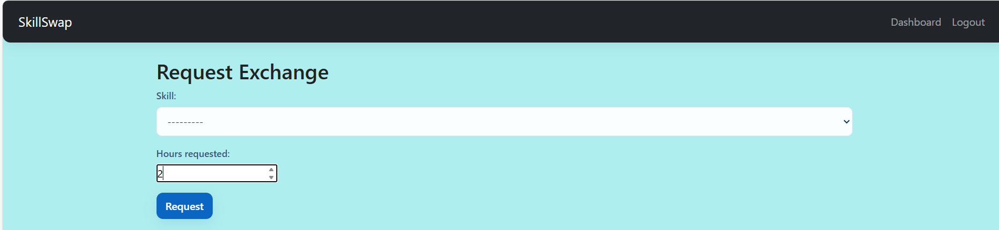
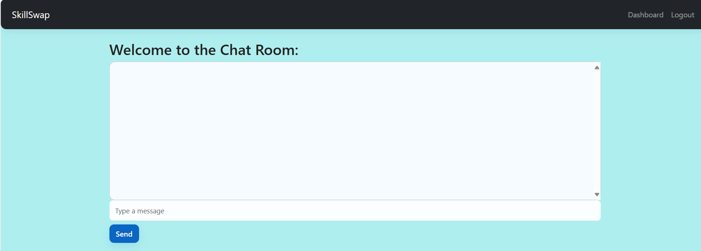

# SkillSwap

**SkillSwap** is a web application built with **Django** that allows users to exchange skills and offer time-based services. Users can register, add their skills, request exchanges, and communicate via a chat system. This project focuses on both frontend design and backend functionality for a complete skill-sharing platform.

---

## Features

### ✅ Completed Features
- User registration and authentication (login/logout)
- Dashboard to view user skills
- Add new skills with descriptions and hourly rate
- Exchange requests between users
- Chat functionality between users (real-time chat via Django Channels)
- Calendar view for appointments/events
-  Real-time chat messages display (WebSocket integration to be fully tested)

### ⚡ Upcoming / Pending Features

- Display exchange requests to the recipient user
- Frontend enhancements for all pages
- Additional validation and security improvements

---

## Screenshots
**Home Page:**  


**Register:**  



**Login Page:**  


**Dashboard:**  


**Add Skill:**  


**Exchange Request:**  


**chat Room:**  



---

## Technology Stack

- **Backend:** Python, Django, Django Channels
- **Frontend:** HTML, CSS, Bootstrap 5
- **Database:** SQLite
- **WebSockets:** For real-time chat functionality

---

## Installation

1. Clone the repository:
```bash
git clone https://github.com/your-username/skillswap.git
cd skillswap
